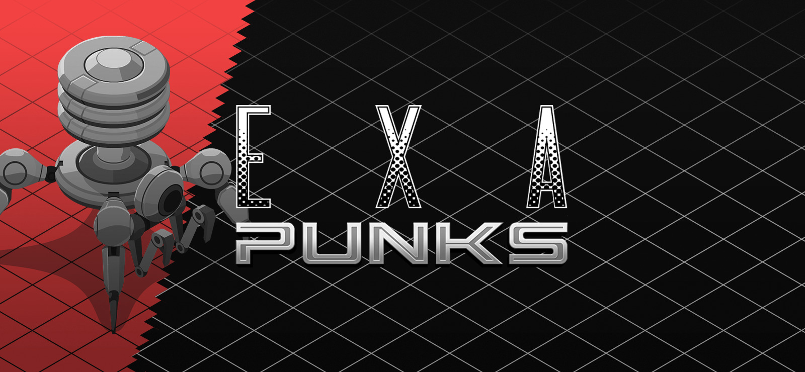

# [E X A P U N K S](http://www.zachtronics.com/exapunks/)

- [E X A P U N K S](#e-x-a-p-u-n-k-s)
  - [About the Game](#about-the-game)
  - [About Me](#about-me)
  - [About the Repo](#about-the-repo)

---

## About the Game

**The year is 1997. You used to be a hacker, but now you have the phage. You made a deal: one hack, one dose. There’s nothing left to lose… except your life.**

`EXAPUNKS` is the latest open-ended puzzle game from Zachtronics, the creators of Opus Magnum, SHENZHEN I/O, TIS-100, and more.

- **READ ZINES** - Learn to hack from `TRASH WORLD NEWS`, the underground computer magazine. Tutorials, hacking tips, secret information, searing commentary—  `TRASH WORLD NEWS` has you covered.
- **WRITE VIRUSES** - Program your `EXA`s (EXecution Agents) to tear through networks, replicate themselves, trash files, terminate other EXAs— and leave without a trace.
- **HACK _EVERYTHING_** - Hack banks, universities, factories, TV stations, highway signs, game consoles, the government... oh yeah, and your own body.

Get it now on [Steam](https://store.steampowered.com/app/716490/EXAPUNKS/).

---

## About Me

Aspiring software engineer, and advanced idiot in the field of _doing a lot of things at once_. Feel free to judge my garbage code.

---

## About the Repo

This was written in Visual Studio, with the help of some Markdown plugins and the [`EXA Syntax Highlighting` plugin](https://marketplace.visualstudio.com/items?itemName=pizzafox.exa-syntax-highlighting). Feel free to add your own solutions by submitting a pull request!

---
